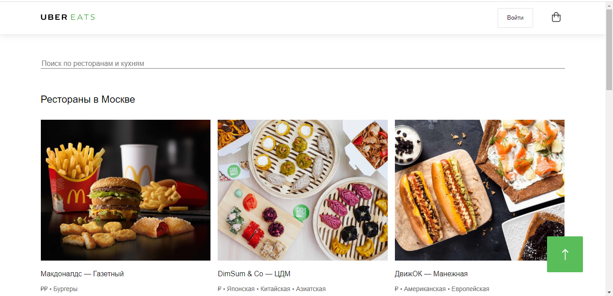
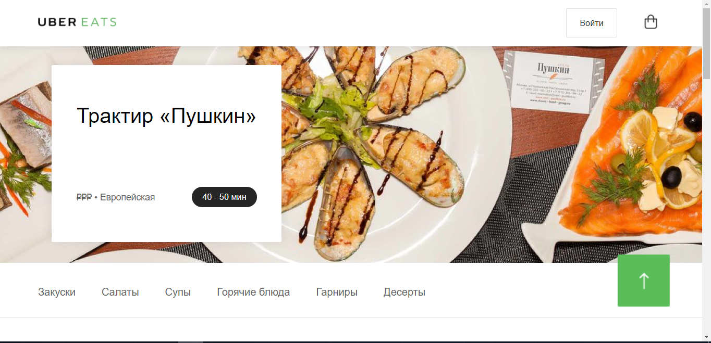

## О проекте

Состоит из следующих адаптивных страниц:

1. _Главная страница._ Здесь представлена информация о ресторанах и кафе.

2. _Ресторан "Пушкин"._ Информация о блюдах ресторана "Пушкин".

Ссылка на проект: [https://github.com/KatBelyaeva/uber_eats](https://github.com/KatBelyaeva/uber_eats)

Ссылка на сайт: [https://uber-eats2.netlify.app/](https://uber-eats2.netlify.app/)

## Контакты

Мой email - [kat.belyaeva.it@gmail.com](kat.belyaeva.it@gmail.com)

